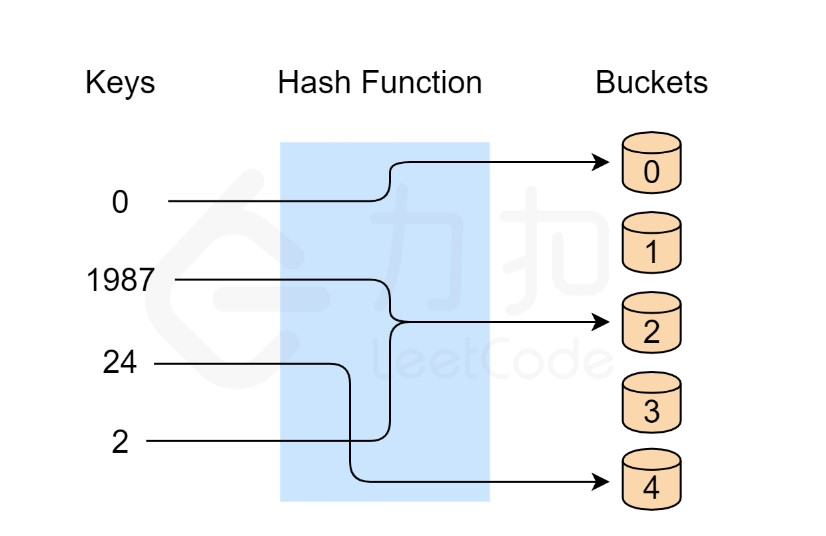
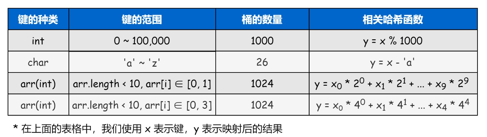
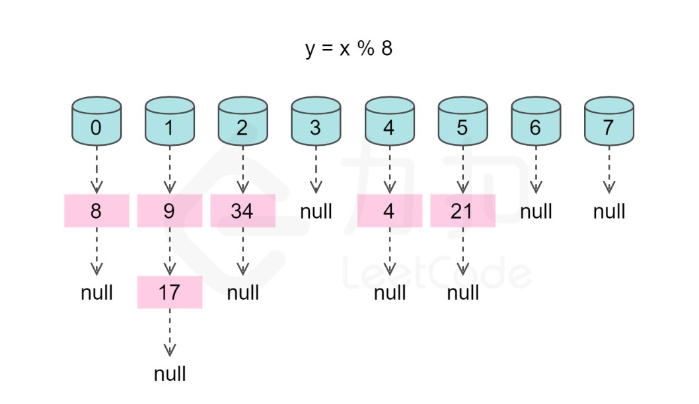
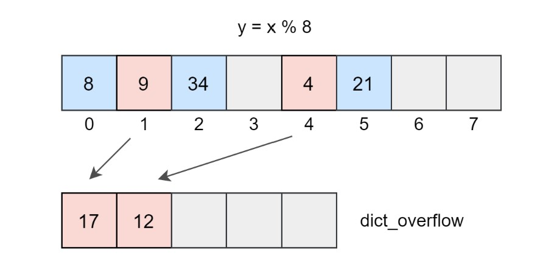

# 哈希表

> 哈希表是一种使用哈希函数组织数据，以支持快速插入和搜索的数据结构

哈希表有两种不同类型：

- 哈希集合：集合的实现方式之一，用于存储非重复值
- 哈希映射：映射的实现之一，用于存储键值对

## 设计哈希表

### 哈希表简介

哈希表又称散列表，借助哈希函数将键映射到存储桶地址，确切的说：

- 首先开辟一定长度的，具有连续物理地址的桶数组
- 插入一个新的键时，哈希函数将决定该键应该分配到哪个桶中，并将该键存在相应的桶中
- 当搜索一个键时，哈希表将使用哈希函数来找到对应的桶，并在该桶中进行搜索

如下方的实例：

哈希函数为$y=x\%5$，我们可以完成插入和搜索的策略：

1. 插入：通过哈希函数解析键，将它们映射到相应的桶中
   - 例如，根据哈希函数，1987将分配给桶 2，而24分配给桶4
2. 搜索：通过哈希函数解析键，得到桶地址，然后在该存储桶中搜索

*注意到键1987和2被映射到了同一个桶中，我们称之为哈希冲突，哈希冲突与哈希函数有关，但又难以避免

### 负载因子

又称装填因子，反映了哈希表的装满程度，等于实际利用桶的个数与桶的总数的比值

如果希望空桶尽可能少，哈希冲突尽可能不发生，可以通过增加桶的数量，选用合适的哈希函数来解决，但桶的数量过多又会造成空间的浪费

比较合理的负载因子是$0.7$。随着插入的数据量增加，计算机逐渐增加桶的数目，并选择合适的哈希函数，使得数据经过分布后能尽可能均匀的分布在桶中

### 设计哈希表时的问题

#### 哈希函数

> 哈希函数是哈希表中最重要的组件，用于将键映射到特定的桶

好的哈希函数应该具备下面的特点：

1. 哈希函数的键与桶的对应关系具有确定性。也就是说，对于key所映射的桶地址，只由key键本身决定，而不由其他因素决定；

2. 哈希函数不应太过复杂。太过于复杂的哈希函数将导致计算桶地址不能快速完成，从而无法快速定位桶；

3. 映射结果的分布应具有均匀性。对于特定的桶空间，我们应尽量保证数据经过哈希函数映射之后，能够均匀地分布在桶的整个地址空间中

下表是一些哈希函数实例：

理想情况下，完美的哈希函数将是键和桶之间的一对一映射。然而，在大多数情况下，完美的哈希函数并不多见。一般来讲，结果分布越随机，越均匀的哈希函数，它的性能越好。一方面，如果分布过于集中在某些桶中，会加剧这些桶发生冲突的概率；另一方面，剩余的桶由于没有得到有效利用导致空间利用率较低

#### 冲突解决

一般情况，哈希函数会起到压缩键的地址空间的作用，因此，经过映射不同数据不可避免地分配到同一个桶中，这就产生了冲突，下面是几种常见的解决冲突的方法：

##### 线性试探法

如果插入key时，发现bucket[hash[key]]已经被占用，则向下线性寻找，直到找到可以使用的空桶。经过第$i$次试探后，桶单元应该为$bucket[(hash(key)+i)\,mod\,m]$

- 查找某个键时，首先通过哈希函数计算桶的地址，比较桶中是否保存该键，若不是继续向下寻找，查找到末尾后，就从头开始寻找
- 删除某个键时，为了避免查找时信息丢失，会将删除位置标记为$deleted$，进行线性查找遇到$deleted$不会中断而是继续向下

##### 链地址法

将桶内产生冲突的键串连成一个链表。如下方这个实例：

与线性探测类似，发生冲突时都需要进行线性查找，导致查找成本增加

##### 再哈希法

比较典型的是**双重哈希法**，发生冲突时使用另一个哈希函数来避免冲突。因此，另一个哈希函数的构造，需要具备一些约束条件才能避免再次冲突

双重哈希存在的问题：

- 与线性试探法相比，双重哈希法会消耗较多的时间
- 在双重哈希法中，删除会使问题变复杂，如果逻辑删除数量太多，则应重新构造哈希表

##### 公共溢出区法

顾名思义，公共溢出区法就是建立另一个哈希表**dict_overflow**作为公共溢出区，当发成冲突时则将该键保存在该哈希表中，如下图：

若查找的键发生冲突，则在公共溢出区进行线性查找

### 复杂度分析

对于哈希表，插入后搜索的平均时间复杂度为$O(1)$，空间复杂度为$O(n)$。但冲突总不可避免，在冲突存在的情况下：

- 如果桶内使用链表或数组进行存储，最坏的情况下，搜索的时间复杂度为$O(n)$
- 若桶内使用高度平衡的二叉搜索树来保存键，则最坏的情况下，插入和搜索的时间复杂度为$O(logn)$

对于空间复杂度，总体来说，桶的个数与键呈线性关系，因此复杂度为$O(M)$，$M$为键的数目

## 实际应用-哈希集合

> C语言没有现成的哈希集合，Python中集合本身就是由哈希实现的

### 使用哈希集合查重

一个典型的问题：给定一个整数数组判断是否包含重复元素，或者对某个数据进行去重操作。

## 实际应用-哈希映射

> 需要同时得到关联信息时，可以使用哈希表建立 key与value的映射关系

如可以构筑下面这些哈希表：

- {键: 下标}

- {键: 频次}：使用频率最高，将元素出现的次数作为值

- {键: 数组}：如果一个键对应的信息是一组元素，可使用数组或链表存储

- {键: 平面坐标}：某些矩阵类习题可能会存储坐标

- {键: 其他}

哈希表也常与滑动窗口结合使用

> 滑动窗口就是将数组或字符串中的一个分段，形象地看作一个“窗口”，通过更改“窗口”的左右边界，实现窗口的移动、缩放等操作

有时哈希表的使用可以很好的优化滑动窗口问题的运行时间
