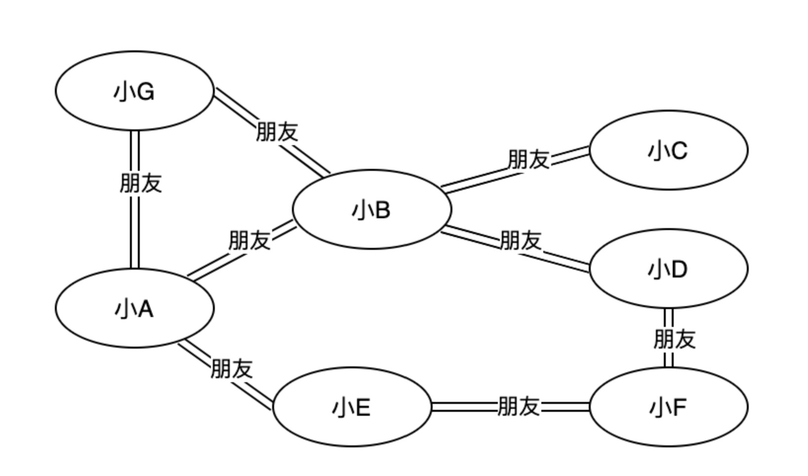
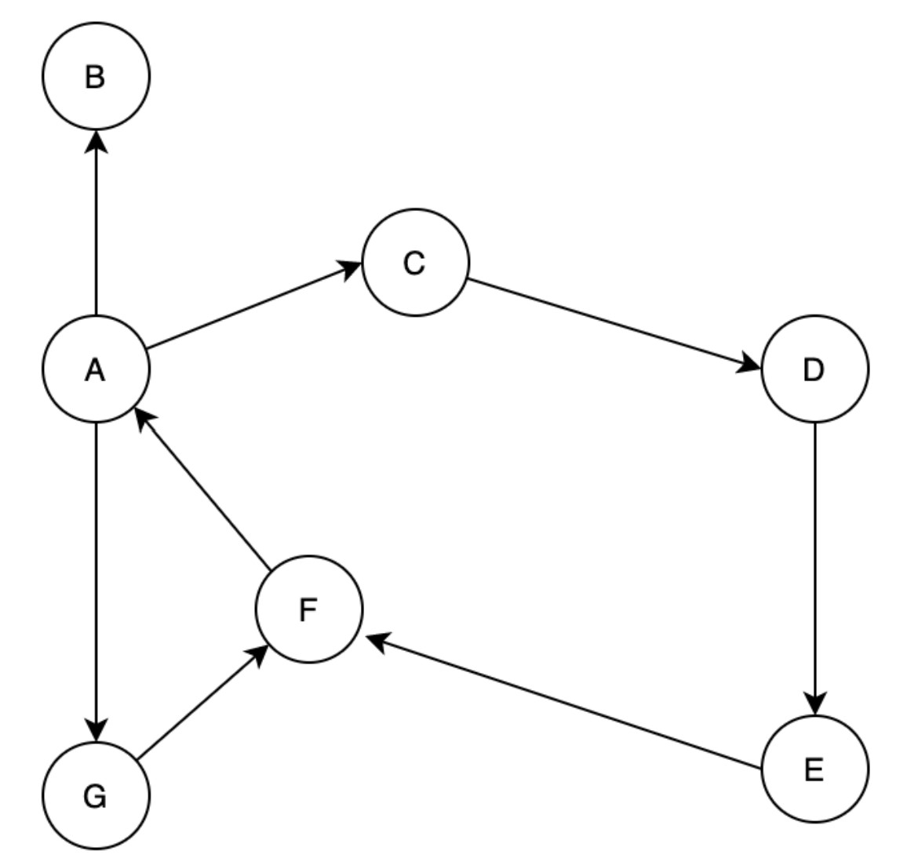
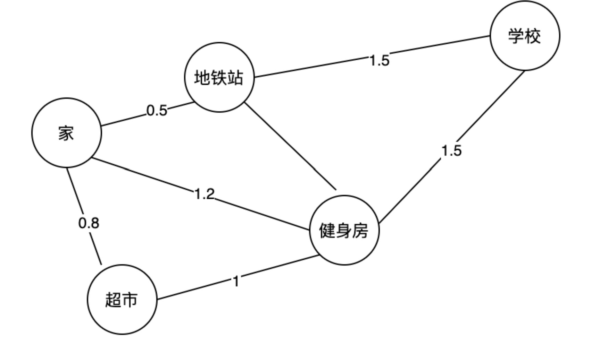
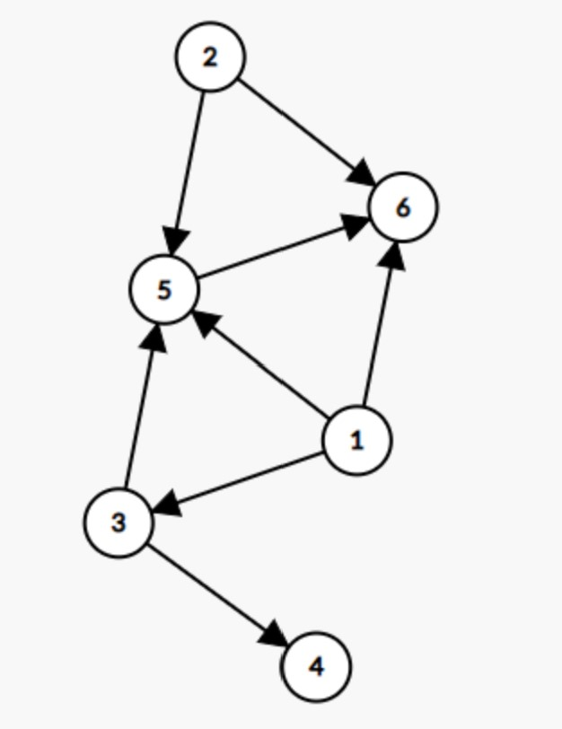
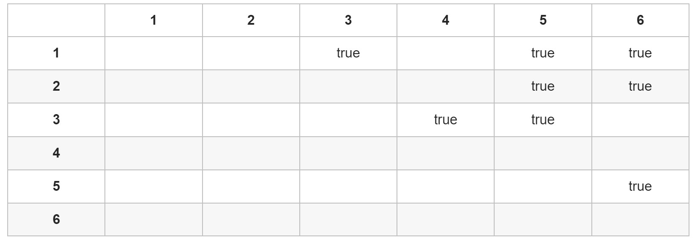
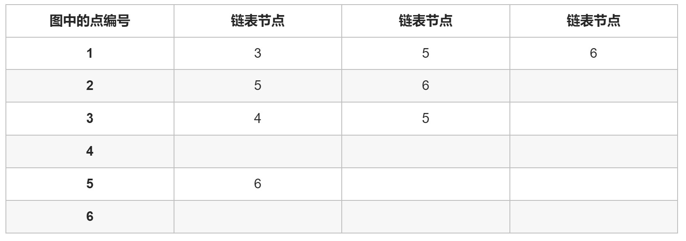
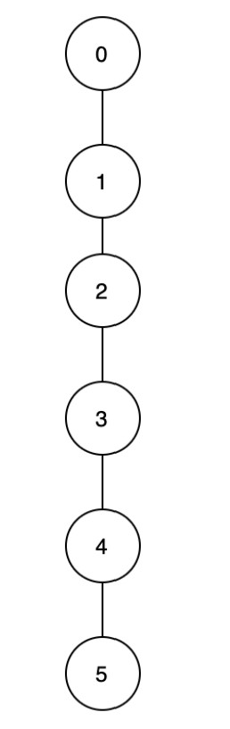

# 图(Graph)


## 基本知识

最接近生活的一种数据结构，如生活中的关系图：



### 类型

- 无向图：图中任意两个顶点的边没有方向，如上方的朋友关系图
- 有向图：图中任意两个顶点之间的边有方向，如：



- 加权图：图中的每条边都带有一个相关的权重。权重可以是任何一种数量，如时间、距离、尺寸等。如下方的地图，可以将距离视作权重：



### 定义和相关术语

**图是由顶点和边组成的非线性数据结构**。

- 顶点：如朋友关系图中，小A、小B等均称为图中的一个顶点
- 边：顶点之间的连线
- 路径：一个顶点到另一个顶点之间经过的所有顶点的集合。需要注意的是，**两个顶点之间的路径可以不止一条**，如上方朋友关系图中小A到小C的路径有：A-B-C、A-E-F-D-C、A-G-B-C
- 路径长度：一条路径经过的边的数量
- 环：起点和终点为同一顶点的路径
- 负权环：在加权图中，某个环的所有边的权重加起来是负数，则称为负权环
- 连通性：两个顶点之间至少存在一条路径，则称两个顶点连通
- 顶点的度：适用于无向图，是与顶点相连的所有边的数目
- 顶点的入度和出度：适用于有向图。若顶点的入读为$d_1$，则有$d_1$条与该顶点相连的边指向该顶点；如出度为$d_2$，则有$d_2$条与该顶点相连的边以该顶点为起点


## 图的存储


### 矩阵存图法

为图中的顶点编号，使用bool型二维数组来存储下方的图：



对应的二维数组（邻接矩阵）为：



*空即表示false。


#### 基本操作

1. 添加一条从i指向j的边，只需要将邻接表中对应的元素赋值true

```c
table[i][j] = true;
```

时间复杂度为$\varTheta(1)$

2. 判断是否存在i指向j的边，只需要查看邻接表中对应的元素是否为true

```c
if(table[i][j]) {
    // 存在
} else {
    // 不存在
}
```

时间复杂度为$\varTheta(1)$

3. 遍历一个点（例如第i点）的所有出边，就是对邻接表中对应行进行行扫面的方式

```c
for(int j = 0; j < n; j++) {
    if(table[i][j]) {
        // 存在一条i指向j的出边
    }
}
```

时间复杂度为$\varTheta(n)$.


#### 空间复杂度

矩阵存图各种操作的时间复杂度都是优秀的，但其空间复杂度为$O(n^2)$，当图为稀疏图（点与点之间的边数远小于$\varTheta(n^2)$）时，大量的空间被浪费。


#### 补充

上方的内容针对无权有向图，其他类型的图同样可以用矩阵存储

- 有权图，使用int类型的数组，两点之间有连边，数组中对应元素的值存为边权即可。因此数组的初始化需要将其中所有元素都设为不可能取到的值（有时会存在0权）
- 无向图，最简单的就是直接将无向边视作两条有向边，如i、j间存在一条边

```c
table[i][j] = table[j][i] = true;
```


### 邻接表存图法

邻接矩阵的问题就是记录了大量不存在边的信息（两点之间不存在边，但也会记录false），这在稀疏图中一定会导致大量空间浪费，我们一般只关注边是否存在。

仍以下图为例：


借助$n$个链表，其中第$i$个链表只存储第$i$个节点直接指向的节点，可以得到下方的邻接表：



链表的节点定义为结构体：

```c
struct node {
    int vertax;  // 边指向的节点编号
    int val;  // 自定义，如用来存边的权重
    struct node *next;
};
```

除此之外，还需要存储$n$个链表，只需要一个struct node*类型的指针数组即可，初始化时均赋值为空


#### 基本操作

1. 添加一条边，如添加i指向j的边，只需在i节点对应的链表表头出插入一个新的节点（至少在C语言中通过链表实现，插在表头成本最低）

```c
new_node.next = Graph[i];
Graph[i] = &new_node;
```

时间复杂度为$\varTheta(1)$。注意：若为无向边，需要添加两次。

2. 判断两个点之间是否有边相连，如判断是否存在i指向j的边，需要遍历i的链表

```c
ptr = Graph[i];
have_found = false;

while(ptr) {
    if(ptr->vertax == j) {
        have_found = true;
        break;
    }
    
    ptr = ptr->next;
}

// have_found存储了是否存在这条边
```

时间复杂度为$\varTheta(i的出度)$

3. 遍历某点的所有出边，就是遍历该点的链表，以第i点为例

```c
ptr = Graph[i];

while(ptr) {
	// 执行操作
    ptr = ptr->next;
}
```

时间复杂度为$\varTheta(i的出度)$


#### 空间复杂度

我们仅存除了存在的边的信息，若用$m$代表图中的边数，则空间复杂度为$\varTheta(m)$


### 链式前向星存图法

链式前向星最大的特征就是为边进行编号

```c
int tot = 0;  // 边的数量
int v[10000];  // v[i]存储第i条边的终点
int len[10000];  // len[i]存储第i条边的权重
```

还需要记录边起点的信息，用数组模拟链表进行存储

```c
int head[10000];  // head[i]表示第i个点对应的第一条边的编号
int next[10000];  // nxt[i]代表i号边下一条的编号
```


#### 基本操作

1. 插入新的边，如i到j的边

```c
void ins(int i, int j, int len) {
    ++tot;
    v[tot] = j;
    len[tot] = len;
    next[tot] = head[i];
    head[i] = tot;
}
```

2. 遍历出边，如遍历i的出边（不妨令边的序号从1开始，初始化时v、head、next三个数组均初始化为0）

```c
for (int k = head[i]; k != 0; k = next[k]) {
    int next = v[k];   // 边所指向的终点
    int cost = len[k];  // 对应的权
}
```

时间复杂度均与邻接表相同。


#### 空间复杂度

若已知边的数量$m$，和点的数量$n$，空间复杂度为$O(3m+n)$. 若对于无向图，需要将边存两次。


## 并查集(Disjoint Set)

并查集用来解决网络中的连通性，如计算机网络、人际网络等。

### 常用术语

- 父节点：顶点的直接父亲节点
- 根节点：没有父节点的节点，可以视本身为自己的父节点


### 基本思想

将相连的节点放置在一个集合中，并选定集合中的某个元素为代表。需要进行连通性（等价关系）判断时，只需要比较两元素的代表元素是否相同。


### 编程思想

编程借助数组进行实现，数组存在两个要素：索引和元素。索引用来代表顶点，元素用来代表父节点。

数组初始化，元素应该等于索引（每个元素都是独立的集合）

```c
for(int i = 0; i < size; i++) {
    root[i] = i;
}
```

当存在等价关系$(i,j)$时，默认以第一个元素为父节点，则可以定义下方函数：

```c
void union(int *root, int i, int j) {
	root[find(root, j)] = i;
}
```

其中查询根节点（利用根节点的父节点是自身)函数定义如下:

```c
int find(int* root, int i) {
	k = i;
    while(k != root[k]) {
        k = root[k];
    }
    
    return k;
}
```

判断连通性（等价），就是比较根节点是否相同：

```c
bool judge(int *root, int i1, int i2) {
    return find(root, i1) == find(root, i2);
}
```

因此，在并查集中存在两个重要的函数：

- uninon函数：依据关系合并两个顶点，保证根节点相同
- find函数：找到根节点（代表元素）


### Quick Find

通过union函数承担更多的职责，保证find函数具有较低的时间复杂度

思想就是root数组中不存父节点，而直接存根节点，find函数就会立刻找到根节点，时间复杂度为$O(1)$，但相应的union函数就需要遍历数组，时间复杂度为$O(n)$.

相应的代码如下：

```c
// 创建并初始化root数组，时间复杂度为O(n)
int *UnionFind(int size) {
    int *root;
    
    root = (int*)malloc(sizeof(int)*size);
    
    for(int i = 0; i < size; i++) {
        root[i] = i;
    }
    
    return root;
}

// 找到函数的根节点，时间复杂度为O(1)
int find(int *root, int ind) {
    return root[ind];
}

// 建立两个集合的关系，时间复杂度为O(n)
void union(int *root, int size, int ind1, int ind2) {
    int root1, root2;
    
    root1 = find(root, ind1);
    root2 = find(root, ind2);
    
    if(root1 != root2) {
        for(int i = 0; i < size; i++) {
            if(find(root, i) == root2) {
                root[i] = root1;
            }
        }
    }
}

// 判断两个节点是否连通，时间复杂度为O(1)
bool isConnected(int *root, int ind1, int ind2) {
    return find(ind1) == find(ind2);
}
```


### Quick Union

通过find函数多承担一些责任，加速union函数。

root数组中存放父节点，以某等价关系$(i, j)$为例，Quick Union是将j连在i的根节点上，并不去考虑其他节点。因此，find函数就需要一直找到根节点才可以返回。

代码实现：

```c
// 创建并初始化root数组，时间复杂度为O(n)
int *UnionFind(int size) {
    int *root;
    
    root = (int*)malloc(sizeof(int)*size);
    
    for(int i = 0; i < size; i++) {
        root[i] = i;
    }
    
    return root;
}

// 找到函数的根节点，时间复杂度为O(h)，h为对应树的高度
int find(int *root, int ind) {
    int r;
    
    r = ind;
    while(root[r] != r) {
        r = root[r];
    }
    
    return r;
}

// 建立两个集合的关系，时间复杂度为O(h)
void union(int *root, int size, int ind1, int ind2) {
    int root1, root2;
    
    root1 = find(root, ind1);
    root2 = find(root, ind2);
    
    if(root1 != root2) {
        root[ind2] = root1;
    }
}

// 判断两个节点是否连通，时间复杂度为O(h)
bool isConnected(int *root, int ind1, int ind2) {
    return find(ind1) == find(ind2);
}
```

后三个函数在最坏的情况下，时间复杂度均为$O(n)$，此时并查集退化为线性结构。


#### 更加高效

在Quick Find中，union的时间复杂度为$\varTheta(n)$，若调用$n$次函数，时间复杂度为$\varTheta(n^2)$.

而Quick Union中，尽在最坏的情况下，时间复杂度才为$O(n^2)$，因此，考虑整体使用后者更加高效。


### 按秩合并的并查集

前面更为高效的Quick Union中，提到的最坏情况就是下图这种退化为线性的结构：



**秩：**通俗来说就是树的高度（注意与深度进行区分）。

按秩合并，即union-by-height，更多的是对于合并的修改。

需要一个额外的数组rank来记录各个节点的所在的高度。代码如下：

```c
root = (int*)malloc(sizeof(int)*size);
rank = (int*)malloc(sizeof(int)*size);

// 时间复杂度O(n)
void init(int *root, int *rank) {
    for(int i = 0; i < size; i++) {
        root[i] = i;
        rank[i] = 1;
    }
}

// 时间复杂度O(logn)
int find(int *root, int ind) {
    int r;
    
    r = ind;
    while(root[r] != r) {
        r = root[r];
    }
    
    return r;
}

// 时间复杂度O(logn)
void union(int *root, int *rank, int ind) {
    int root1, root2;
    
    root1 = find(root, ind1);
    root2 = find(root, ind2);
    
    if(root1 != root2) {
        if(rank[root1] > rank[root2]) {
            root[root2] = root1;
        }
        else if(rank[root1] < rank[root2]) {
            root[root1] = root2;
        }
        else {
            root[root2] = root1;
            rank[root1] += 1;
        }
    }
}

// 时间复杂度O(logn)
bool isConnected(int *root, int ind1, int ind2) {
    return find(root, ind1) == find(root, ind2);
}
```

复杂度的计算可以考虑在按秩合并的条件下，最坏的情况就是N叉树，因此复杂度为$O(logn)$.


### 路径压缩优化的并查集

在之前的Quick Union方法中，寻找一个节点的根节点需要不断迭代，当下次再寻找这个节点的根节点时，仍然需要重复计算。

路径压缩的想法是，在find过程中，将路径上的每个节点的父节点都改为根节点，在多次使用find函数时，就可以获得优化的效果。

代码实现：

```c
// 创建并初始化root数组，时间复杂度为O(n)
int *UnionFind(int size) {
    int *root;
    
    root = (int*)malloc(sizeof(int)*size);
    
    for(int i = 0; i < size; i++) {
        root[i] = i;
    }
    
    return root;
}

// 递归实现路径压缩，时间复杂度为O(logn)
int find(int *root, int ind) {
    int r;
    
    r = ind;
    
    if(ind != root[ind]) {
        r = find(root, root[ind]);
        root[ind] = r;
    }
    
    return r;
}

// 建立两个集合的关系，时间复杂度为O(logn)
void union(int *root, int size, int ind1, int ind2) {
    int root1, root2;
    
    root1 = find(root, ind1);
    root2 = find(root, ind2);
    
    if(root1 != root2) {
        root[ind2] = root1;
    }
}

// 判断两个节点是否连通，时间复杂度为O(logn)
bool isConnected(int *root, int ind1, int ind2) {
    return find(ind1) == find(ind2);
}
```

最坏的情形仍是N叉树


### 基于路径压缩的按秩合并优化的并查集

综合按秩合并优化和路径压缩优化

```c
root = (int*)malloc(sizeof(int)*size);
rank = (int*)malloc(sizeof(int)*size);

// 时间复杂度O(n)
void init(int *root, int *rank) {
    for(int i = 0; i < size; i++) {
        root[i] = i;
        rank[i] = 1;
    }
}

int find(int *root, int ind) {
    int r;
    
    r = ind;
    
    if(ind != root[ind]) {
        r = find(root, root[ind]);
        root[ind] = r;
    }
    
    return r;
}

void union(int *root, int *rank, int ind) {
    int root1, root2;
    
    root1 = find(root, ind1);
    root2 = find(root, ind2);
    
    if(root1 != root2) {
        if(rank[root1] > rank[root2]) {
            root[root2] = root1;
        }
        else if(rank[root1] < rank[root2]) {
            root[root1] = root2;
        }
        else {
            root[root2] = root1;
            rank[root1] += 1;
        }
    }
}

bool isConnected(int *root, int ind1, int ind2) {
    return find(root, ind1) == find(root, ind2);
}
```

后三个函数的时间复杂度为$\alpha(n)$

